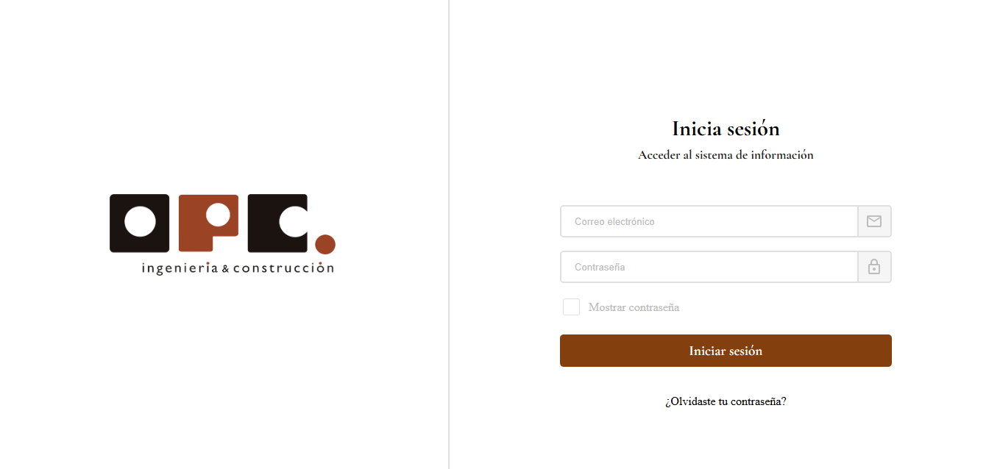
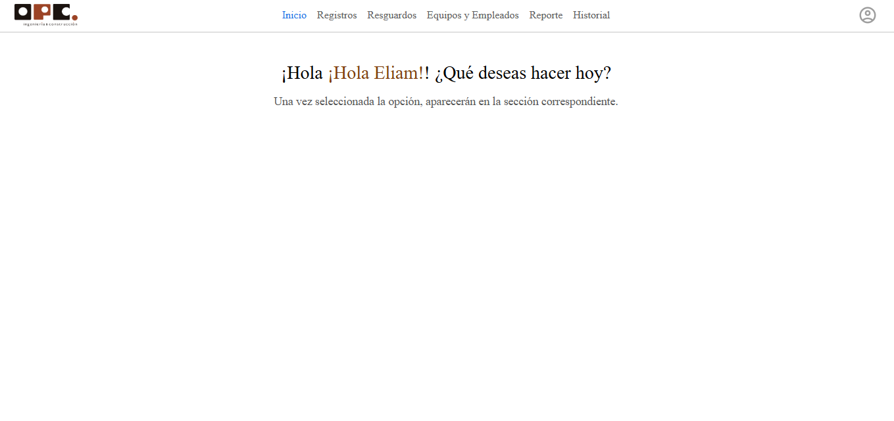
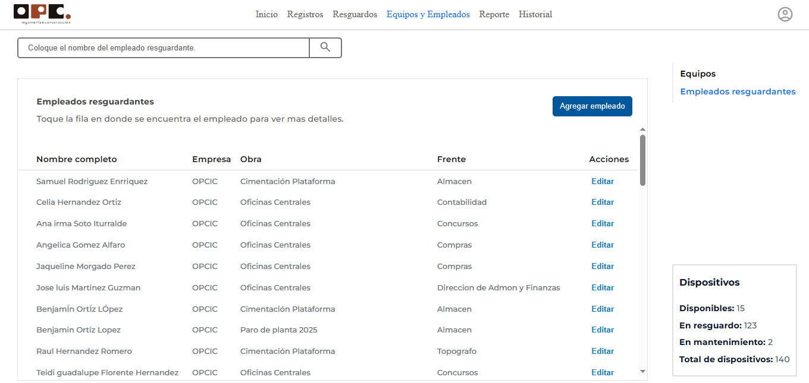
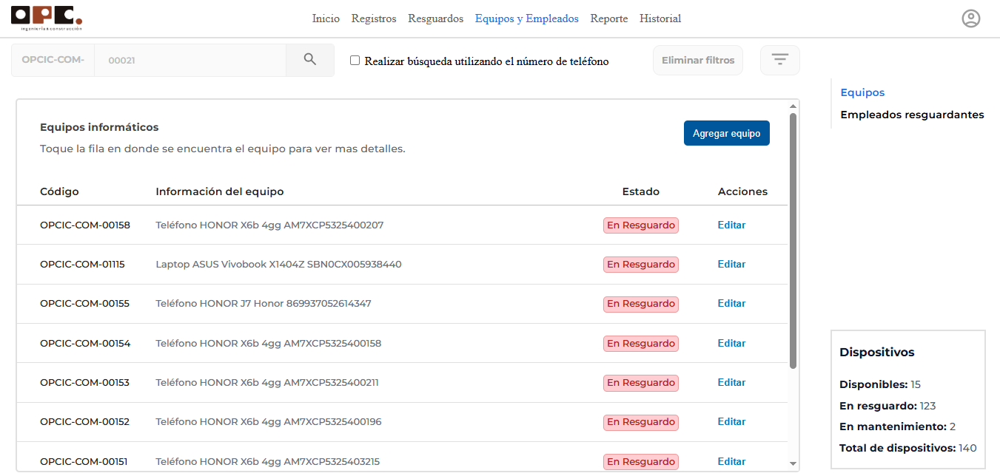
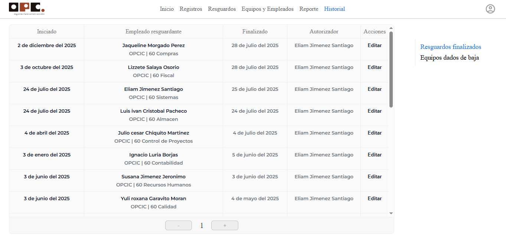
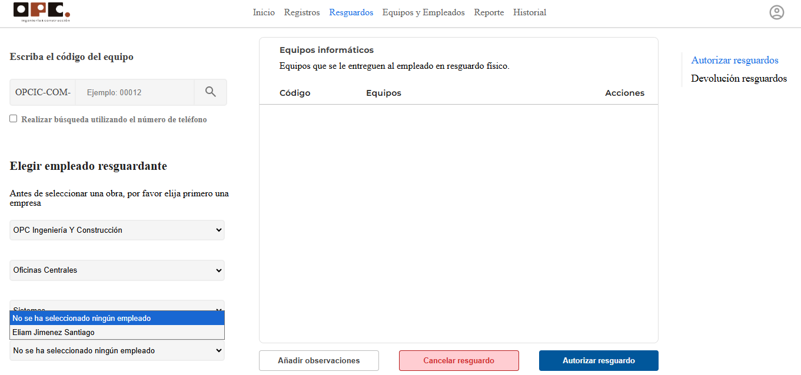
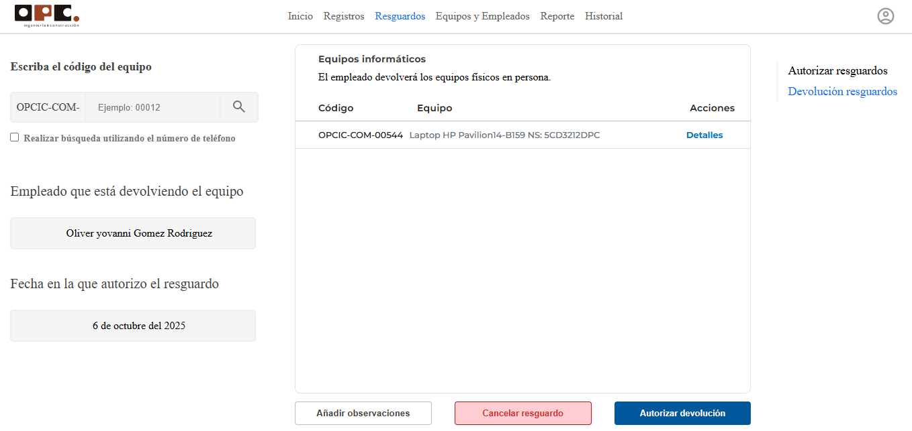

# 💻 SIGEI - Sistema de Gestión de Equipos Informáticos

**SIGEI** es una aplicación web interna desarrollada para **OPC Ingeniería y Construcción**, diseñada para controlar, gestionar y dar seguimiento al inventario de equipos informáticos asignados a los empleados en diferentes obras, empresas y frentes.

---

## 🧾 Características principales

- 🔐 Autenticación por roles de usuario
- 👤 Registro de empleados resguardantes
- 🏢 Registro y gestión de empresas, obras y frentes
- 💻 Registro detallado de equipos informáticos (categoría, modelo, serie, etc.)
- 📦 Resguardo y devolución de equipos a empleados
- 📊 Reportes dinámicos con estadísticas de equipos por empresa, obra o frente
- 🧾 Generación de historial de movimientos y exportación de reportes

---

## 📂 Estructura del sistema

### Módulos del sistema

| Módulo                  | Descripción |
|-------------------------|-------------|
| Inicio / Dashboard      | Vista general del sistema con accesos directos |
| Registros               | Crear equipos, empleados, empresas, obras y frentes |
| Resguardos              | Asignar o devolver equipos a empleados |
| Equipos y Empleados     | Consulta general de la base de datos |
| Reporte                 | Gráficas y conteo de equipos por entidad |
| Historial               | Seguimiento de movimientos por fecha o empleado |

---

## 🧰 Tecnologías utilizadas

- **Frontend**: HTML, CSS, JavaScript (modular)
- **Backend**: PHP 8.x
- **Base de datos**: MySQL (phpMyAdmin)
- **Servidor local**: XAMPP

---

## 📁 Estructura de carpetas
📦information-system_opc
├── 📁client → Archivos HTML, JS y CSS
├── 📁server → Conexiones PHP con la base de datos
│ ├── config/ → Credenciales DB
│ ├── endpoints/ → Módulos para insertar/consultar equipos, usuarios, etc.
│ ├── img/ → Carpeta donde se guardan las imágenes de los equipos
│ ├── pdf/ → Carpeta para guardar facturas u otros documentos
│ └── esquema.sql → Archivo SQL con las tablas del sistema (base limpia)
├── 📁js/utilities → Funciones reutilizables (fetch, fechas, validaciones)

## 🧪 Cómo ejecutar el sistema

1. Clona el repositorio:
   ```bash
   git clone https://github.com//sigei.git
2-Instala XAMPP y activa Apache y MySQL.

3-Copia la carpeta del proyecto a:

    C:\xampp\htdocs\information-system_opc
    
4-Abre phpMyAdmin en tu navegador:
    
    http://localhost/phpmyadmin

5-Crea la base de datos llamada inventario y importa el archivo esquema.sql ubicado en:

    /information-system_opc/sql/esquema.sql

6-Inicia sesión con:
      Usuario: ejimenez@grupoopc.com
      Contraseña: puma1731

7-Accede en el navegador a:

      http://localhost/information-system_opc/client/


##📊 Reportes y estadísticas
    El sistema incluye un panel de reportes gráficos con:

  Distribución por empresa, obra y frente

  Total de empleados, equipos y obras registradas

  Exportación de datos en Excel o PDF

📎 Archivos importantes

        sql/esquema.sql: Base de datos limpia del sistema

        server/img/: Carpeta donde se guardan imágenes físicas de los equipos

        server/pdf/: Carpeta para facturas (formato PDF)

        capturas/: Screenshots de las funcionalidades del sistema (subidas en el repositorio)
        
📸 Capturas del sistema

## 📸 Capturas del sistema

## 📸 Capturas del sistema

| Login | Dashboard |
|-------|-----------|
|  |  |

| Empleados | Equipos | Historial |
|-----------|---------|-----------|
|  |  |  |

| Resguardos | Devoluciones |
|------------|--------------|
|  |  |

| Registro empleados | Registro empresas | Registro equipos | Registro usuarios |
|--------------------|-------------------|------------------|-------------------|
|  |  |  |  |

| Reporte general | Reporte detallado |
|-----------------|-------------------|
|  |  |

🧑 Autor
Nombre: Eliam Jiménez Santiago

Rol: Desarrollador Backend
Proyecto desarrollado durante la estancia profesional 2025
Ubicación: Coatzacoalcos, Veracruz, México
En colaboracion con Jesus Perez Hidalgo tenienedo el rol de Frontend

📧 eliam1731@hotmail.com
🌐 LinkedIn: linkedin.com/in/eliam-jiménez-santiago-1a3244324

📜 Licencia
Este proyecto es de uso interno exclusivo para OPC Ingeniería y Construcción. No está autorizado su uso comercial ni distribución sin permiso.

